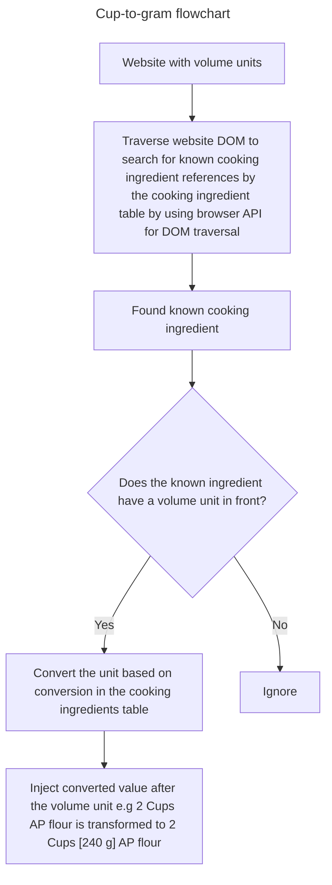

# Cup-to-gram

## What is it?
Cup-to-gram is a Typescript based extension for Chromium based and Firefox browsers that converts cup measurements (either metric or imperial) to grams on recipe websites. It uses a predefined conversion table of cooking ingredients to them from volume units to grams, making it easier for users to follow recipes that use different measurement systems.

## How does it work?
The extension works by injecting a content script into the web page of recipe websites. The content script scans the page for any cup measurements and replaces them with their corresponding gram values based on the conversion table.

## Tech stack
- Typescript
- plasmohq/plasmo framework for browser extension development
- Biome for code formatting and linting
- esbuild for bundling the extension
- GitHub Actions for continuous integration and deployment
- Jest for testing

## Conventions and Architecture
### Convetions
- Vertical slicing for features: Each feature is organized into its own folder containing all related files (components, styles, tests, etc.).
- Clear separation of concerns: Each file and component has a single responsibility, making the codebase easier to maintain and understand.
- Consistent naming conventions: Use clear and descriptive names for files, functions, and variables to enhance readability.
- no any types: Avoid using `any` type in TypeScript to ensure type safety and maintainability of the codebase. Instead, define specific types and interfaces for better code clarity and error prevention.
- Use AAA pattern for tests: Arrange, Act, Assert structure for writing tests to improve readability and maintainability.
- Comments must only be used to explain "why" something is done, not "what" is being done. The code should be self-explanatory in terms of its functionality, and comments should provide context or reasoning behind certain decisions or implementations.

### Architecture
Flowchart in mermaid syntax to illustrate the architecture of the extension:

## Testing
The extension uses Jest for testing. Tests are organized in a `__tests__` folder within each feature folder, following the vertical slicing convention. Each test file corresponds to a specific component or functionality, ensuring that tests are focused and maintainable.

For e2e test flow we have a test that simulates the extension running on a sample recipe website (the sample recipe website is stored in test-assets folder), verifying that cup measurements are correctly converted to grams based on the conversion table.